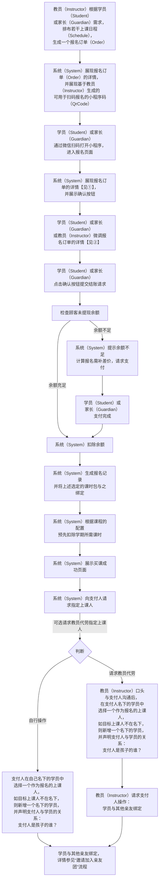

# “报名” 功能需求概要

### 整体流程：

备注：教员（Instructor）提供的小程序码需要带上教员标识（Instructor Id），以便机构可跟踪教员（Instructor）导购绩效

#### ① 展现订单中每一报名项时

	请求顾客指定或引导教员与顾客确认上课人

	从两个来源汇总候选课时包
	1.在顾客名下或学员名下的课时包中匹配
	2.在机构的供选课时包中匹配（选中后纳入计费项）
	默认选中一个课时包

	展现顾客名下的学员作为候选上课人

#### ② 微调订单中每一报名项时，将触发排列在该报名项之后的各报名项的状态重算
<!--stackedit_data:
eyJoaXN0b3J5IjpbLTE2MjcxOTIzMTIsOTA0MjgwMjE2LC05Mj
cwNDYyNDIsLTMyNzQ0MjI0LC0xNjUxMjI2NjM5LDc3NzQxNTM4
MywtNjM2NzAxMTI5LDE0MTQxMzU5NDddfQ==
-->