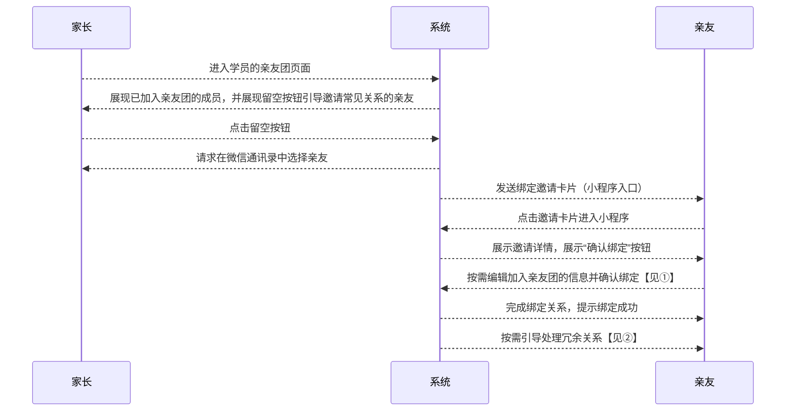
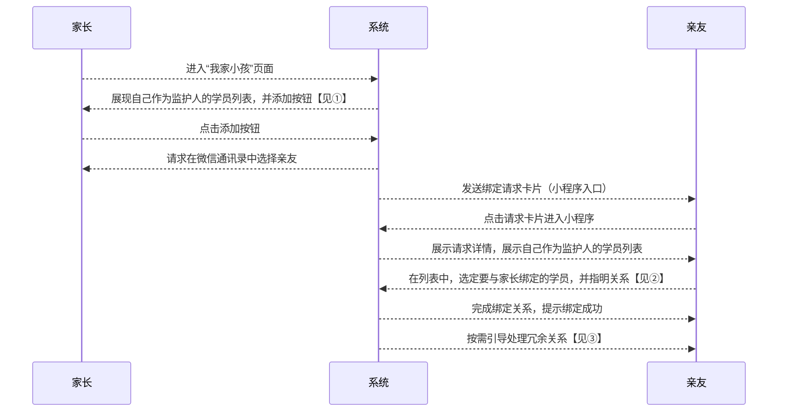

# “家长-学员关系绑定流程” 功能需求概要

TODO：需要考虑合并功能

## 流程

### 邀请绑定流程：

#### ① 展示邀请详情时，展示内容包括：邀请人名称、学员名称、与学员的关系，其中，与学员的关系可编辑，点击确认时提交编辑结果

#### ② 如发现亲友名下原有绑定关系与新建立的疑似冗余，按需引导处理冗余关系

### 请求绑定流程：

#### ① 界面上须告知用户：请求为孩子报名的亲友将自己绑定成为监护人

#### ② 应该考虑支持多选，这样可以批量搞掂多个绑定

#### ③ 如发现亲友名下原有绑定关系与新建立的疑似冗余，按需引导处理冗余关系

## 页面规划

1. 名下的学员列表
	* 用户
		* 学员
		* 家长
	* 功能
		* 展示名下的学员列表
			* 当前用户作为监护人的学员
				* 学员名称
				* 学员性别
				* 学员生日
			* 当前用户本人作为学员
				* 异化展示的样式
		* 新增绑定的学员
		* 解除与指定学员的绑定
		* 触发学员记录去重
			* 非常用功能，建议收到操作菜单的“更多”中
			* 点击后选择要与选中的学员合并的另一学员
			* 选定要合并的多名学员后，展示合并提示，包括合并后的学员资料和亲友团情况和主监护人情况
		* 查看学员的详情

2. 学员详情页
	* 用户
		* 学员
		* 家长
	* 功能
		* 展示学员信息
			* 展示本人与学员的关系
			* 展示学员的资料：头像、备注+昵称
			* 展示学员的亲友团列表
		* 编辑学员信息
			* 编辑本人与学员的关系
			* 编辑学员资料
			* 编辑学员的亲友团列表
				* 增加：邀请加入
				* 删除：根据权限情况显隐或无权限时点击后出权限提示
		* 查看学员亲友的详情

3. 学员亲友的详情展示/编辑
	* 用户
		* 家长
	* 功能
		* 展示学员亲友的信息
			* 展示亲友与学员的关系
			* 展示亲友的资料：头像、备注+昵称
			* 展示亲友为学员最近一次签到时间
				* 点击“查看全部”按钮后可查看全部签到记录
		* 编辑学员亲友的信息：学员亲友本人或学员主监护人可操作
			* 编辑亲友与学员的关系
			* 编辑亲友的资料：备注

4. 邀请加入亲友团
	* 用户
		* 家长
	* 功能

5. 请求加入亲友团
	* 用户
		* 家长
	* 功能

<!--stackedit_data:
eyJoaXN0b3J5IjpbNjE2NDg3NzczLC0xOTkxNDgxODk5LDIwMT
AxMDQ5MzcsOTEyNTUyMzI0LC0zMjkxMjE0NjcsLTExODQyMzM0
MTEsLTE2MTQyNjQ4NzMsMTExNTg1NjgwNSwtMTEwODAzNDU1NS
wtMTQ0Mzg3MDE3MywtMTE2MDQ0MzQ5MSw5MDMxNDc3NywtMTc3
MTE1OTk3MiwxODAyNTI4ODA0LC0xOTY3MTE2MjksLTgxNTEwND
YsLTM1OTA4MTYzLC0xNDI3NDUxMTEyLC0xMzgxODAwMjcsLTE1
ODEyNTQ1MDNdfQ==
-->