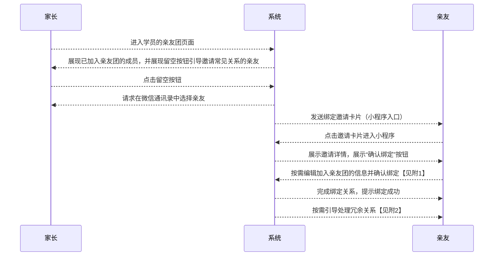
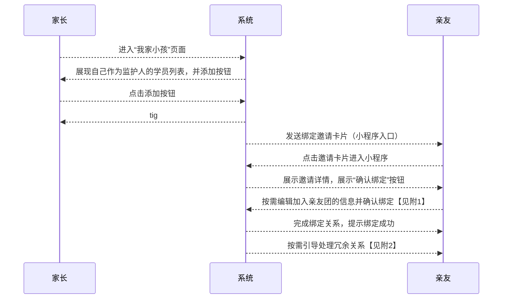

# “家长-学员关系绑定流程” 功能需求概要

TODO：需要考虑合并功能
TODO：家长请求与孩子的绑定关系，可以通过向主监护人发绑定邀请的请求来实现

## 流程

### 邀请绑定流程：

#### 附1：展示邀请详情时，展示内容包括：邀请人名称、学员名称、与学员的关系，其中，与学员的关系可编辑，点击确认时提交编辑结果

#### 附2：如发现亲友名下原有绑定关系与新建立的疑似冗余，按需引导处理冗余关系

### 请求绑定流程：

## 页面规划

### 亲友团列表

### 亲友详情展示/编辑

### 请求加入亲友团
<!--stackedit_data:
eyJoaXN0b3J5IjpbLTE1MjQzMjYxNDgsLTE0Mjc0NTExMTIsLT
EzODE4MDAyNywtMTU4MTI1NDUwMywxODU4OTgzMjgxLC0xOTE2
ODA0NDUzLDE3NTc3MTg3OTcsMTEwMDc2MDc2NSwtMjAyMTc2OT
g0MCwxMDg3NTg0MDc0LDcyNDMyMjcsNTM4MDIzODkyLC05Njcw
NzczNzIsMTM4NTE3NDA2MywtMTA3NDk5NDM4OSwxMzg1MTc0MD
YzXX0=
-->