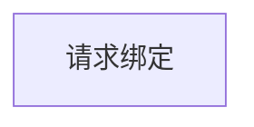

# “家长-学员关系绑定流程” 功能需求概要

TODO：需要考虑合并功能
TODO：家长请求与孩子的绑定关系，可以通过向主监护人发绑定邀请的请求来实现

## 流程

### 邀请绑定流程：

```mermaid
sequenceDiagram

家长-->进入学员的亲友团页面

```

### 请求绑定流程：



## 页面规划

### 亲友团列表

### 亲友详情展示/编辑

### 请求加入亲友团
<!--stackedit_data:
eyJoaXN0b3J5IjpbNzI0MzIyNyw1MzgwMjM4OTIsLTk2NzA3Nz
M3MiwxMzg1MTc0MDYzLC0xMDc0OTk0Mzg5LDEzODUxNzQwNjNd
fQ==
-->