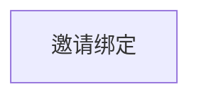
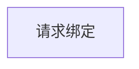

# “家长-学员关系绑定流程” 功能需求概要

TODO：需要考虑合并功能
TODO：家长请求与孩子的绑定关系，可以通过向主监护人发绑定邀请的请求来实现

## 流程

### 邀请绑定流程：

### 请求绑定流程：

## 页面规划

### 
<!--stackedit_data:
eyJoaXN0b3J5IjpbMTgxMTgwNzg2NiwtOTY3MDc3MzcyLDEzOD
UxNzQwNjMsLTEwNzQ5OTQzODksMTM4NTE3NDA2M119
-->