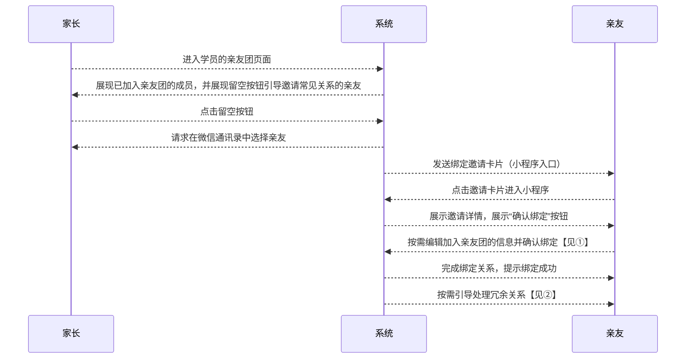
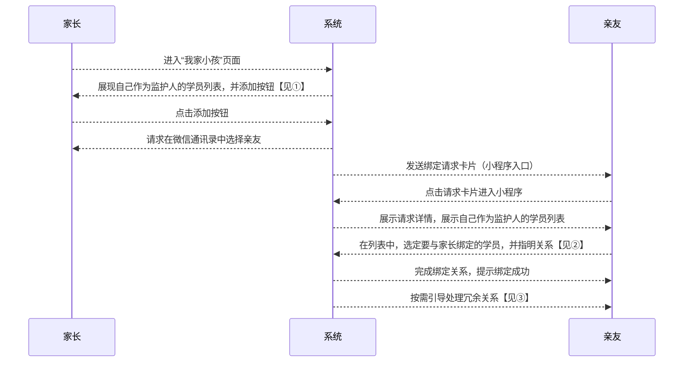

# “家长-学员关系绑定流程” 功能需求概要

TODO：需要考虑合并功能

## 流程

### 邀请绑定流程：

#### ① 展示邀请详情时，展示内容包括：邀请人名称、学员名称、与学员的关系，其中，与学员的关系可编辑，点击确认时提交编辑结果

#### ② 如发现亲友名下原有绑定关系与新建立的疑似冗余，按需引导处理冗余关系

### 请求绑定流程：

#### ① 界面上须告知用户：请求为孩子报名的亲友将自己绑定成为监护人

#### ② 应该考虑支持多选，这样可以批量搞掂多个绑定

#### ③ 如发现亲友名下原有绑定关系与新建立的疑似冗余，按需引导处理冗余关系

## 页面规划

1. 名下的学员列表
	* 用户
		* 学员
		* 家长
	* 功能
		* 展现当前用户本人和他作为监护人的学员列表

3. 孩子的亲友团列表

4. 亲友详情展示/编辑

5. 请求加入亲友团
<!--stackedit_data:
eyJoaXN0b3J5IjpbOTAzMTQ3NzcsLTE3NzExNTk5NzIsMTgwMj
UyODgwNCwtMTk2NzExNjI5LC04MTUxMDQ2LC0zNTkwODE2Mywt
MTQyNzQ1MTExMiwtMTM4MTgwMDI3LC0xNTgxMjU0NTAzLDE4NT
g5ODMyODEsLTE5MTY4MDQ0NTMsMTc1NzcxODc5NywxMTAwNzYw
NzY1LC0yMDIxNzY5ODQwLDEwODc1ODQwNzQsNzI0MzIyNyw1Mz
gwMjM4OTIsLTk2NzA3NzM3MiwxMzg1MTc0MDYzLC0xMDc0OTk0
Mzg5XX0=
-->