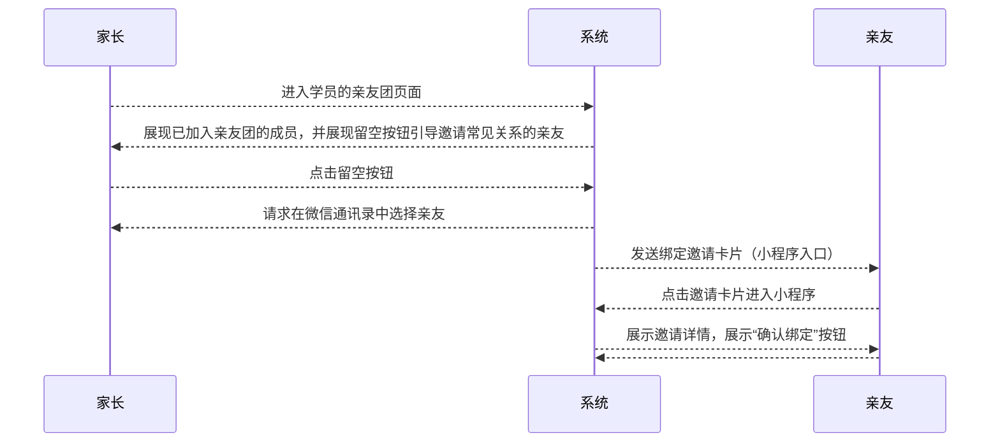

# “家长-学员关系绑定流程” 功能需求概要

TODO：需要考虑合并功能
TODO：家长请求与孩子的绑定关系，可以通过向主监护人发绑定邀请的请求来实现

## 流程

### 邀请绑定流程：

#### PS：展示邀请详情时，展示内容包括：邀请人名称，学员名称，与学员的关系

### 请求绑定流程：

## 页面规划

### 亲友团列表

### 亲友详情展示/编辑

### 请求加入亲友团
<!--stackedit_data:
eyJoaXN0b3J5IjpbLTE5Nzk1MDMzNCwtMTkxNjgwNDQ1MywxNz
U3NzE4Nzk3LDExMDA3NjA3NjUsLTIwMjE3Njk4NDAsMTA4NzU4
NDA3NCw3MjQzMjI3LDUzODAyMzg5MiwtOTY3MDc3MzcyLDEzOD
UxNzQwNjMsLTEwNzQ5OTQzODksMTM4NTE3NDA2M119
-->