# “报名” 功能需求概要

### 整体流程：

备注：教员（Instructor）提供的小程序码需要带上教员标识（Instructor Id），以便机构可跟踪教员（Instructor）导购绩效

```mermaid
graph TD

生成报名订单-->生成报名码
生成报名码-->扫码报名
扫码报名-->展现报名订单
展现报名订单-->微调报名订单
微调报名订单-->确认并提交结账请求
确认并提交结账请求-->检查顾客未提现余额
检查顾客未提现余额--余额充足-->扣除余额
检查顾客未提现余额--余额不足-->请求支付
请求支付-->支付完成
支付完成-->扣除余额
扣除余额-->生成报名记录
生成报名记录-->预扣除课时
预扣除课时-->提示买课成功
提示买课成功-->请求身份声明
请求身份声明-->指定上课人
指定上课人--是否请求教员代劳指定上课人-->是否请求教员代劳指定上课人
是否请求教员代劳指定上课人--是-->教员代理身份声明
是否请求教员代劳指定上课人--否-->学员与其他家长绑定
教员代理身份声明-->请求绑定学员与其他家长
请求绑定学员与其他家长-->学员与其他家长绑定

生成报名订单["<center>教员（Instructor）根据学员（Student）<br>或家长（Guardian）需求，<br>排布若干授课安排（Schedule），<br>生成一个报名订单（Order）</center>"]

生成报名码["<center>系统（System）展现报名订单（Order）的详情，<br>并展现基于教员（Instructor）生成的<br>可用于扫码报名的小程序码（QrCode）</center>"]

扫码报名["<center>学员（Student）或家长（Guardian）<br>通过微信扫码打开小程序，进入报名页面</center>"]

展现报名订单["<center>系统（System）展现报名订单的详情【见①】，<br>并展示确认按钮</center>"]

微调报名订单["<center>学员（Student）或家长（Guardian）<br>或教员（Instructor）微调报名订单的详情【见②】</center>"]

确认并提交结账请求["<center>学员（Student）或家长（Guardian）<br>点击确认按钮提交结账请求</center>"]

请求支付["<center>系统（System）提示余额不足<br>计算报名需补差价，请求支付</center>"]

支付完成["<center>学员（Student）或<br>家长（Guardian）<br>支付完成</center>"]

扣除余额["<center>系统（System）扣除余额</center>"]

生成报名记录["<center>系统（System）生成报名记录<br>并将上述选定的课时包与之绑定</center>"]

预扣除课时["<center>系统（System）根据课程的配置<br>预先扣除学期所需课时</center>"]

提示买课成功["<center>系统（System）展示买课成功页面</center>"]

请求身份声明["<center>系统（System）向支付人请求指定上课人</center>"]

指定上课人["<center>支付人在自己名下的学员中选择一个作为报名的上课人，<br>如目标上课人不在名下，则新增一个名下的学员，<br>并声明学员与支付人的关系：支付人是孩子的谁？</center>"]

是否请求教员代劳指定上课人{判断}

教员代理身份声明["<center>教员（Instructor）口头与支付人沟通后，<br>在支付人名下的学员中选择一个作为报名的上课人，<br>如目标上课人不在名下，则新增一个名下的学员，<br>并声明学员与支付人的关系：支付人是孩子的谁？</center>"]

请求绑定学员与其他家长["<center>教员（Instructor）请求支付人操作：<br>学员与其他亲友绑定，<br>详情参见家长-学员关系绑定流程</center>"]

学员与其他家长绑定["<center>学员与其他亲友绑定，<br>详情参见家长-学员关系绑定流程</center>"]
```

#### ① 展现订单中每一报名项时

	从两个来源汇总候选课时包
	1.在顾客名下或学员名下的课时包中匹配 
	2.在机构的供选课时包中匹配（选中后纳入计费项）
	默认选中一个课时包

	gen

#### ② 可按需更改选用的课时包

### 页面规划：

1. 订单生成页
	* 用户
		* 教员（Instructor）
		* 学员（Student）
		* 家长（Guardian）
	* 状态
		- a. 定位课程（默认态）
			* 功能
				* 根据名称搜索机构（Organization）下课程（Course）
			* 展示信息
				* 搜索课程（Course）的搜索框
		- b. 搜索课程结果
			* 功能
				* 列出课程（Course）下的所有课班（Class）
					* 仍有学位的课班（Class）用彩色展现
					* 已满员的课班（Class）用灰色展现
				* 点选某课班（Class）后，提供列表和周期表两种形式展现该课班（Class）下的所有授课安排（Schedule）
			* 展示信息
				* 课程（Course）信息，包括名称（Name）、简介（Description）、课程负责人列表（Instructors）
				* 班课（Class）信息，包括名称（Name）、简介（Description）、班课负责人列表（Instructors）
		- c. 展现课班（Class）下的所有授课安排（Schedule）
			* 功能
				* 根据课班（Class）的配置，确定授课安排（Schedule）是必须全选还是允许部分选择，提供不同的交互形式供用户选择，选择后将授课安排（Schedule）添加到订单
				* 授课安排（Schedule）添加完毕后，点击生成订单按钮，将生成订单的请求提交到系统（System）
				* 系统（System）生成订单完毕后，跳转到订单确认页
			* 展示信息
				* 授课安排（Schedule）信息，包括上课时间（Start Time）、上课地点（Location）、上课教员（Instructor）、上课时长（Last Time）

2. 订单确认页
	* 备注：上课时间冲突在教员那端也要有提示
	* 备注：教员在修改订单的课程内容时需要同步展现给顾客，并且有修改的增量提示（某某课程被剔除等）
	* 用户
		* 教员（Instructor）
		* 学员（Student）
		* 家长（Guardian）
	* 功能
		* 展示订单（Order）信息，供用户确认
		* 订单中的授课安排列表（Schedules）于学员（Student）的上课安排列表（Schedules）存在冲突时，提示冲突部分
		* 提供确认按钮，供用户在确认时提交结账请求
	* 展示信息
		* 订单（Order）信息，包括订单发起人（Order Initiator）、订单发起时间（Order Time）、订单中授课安排列表（Order Schedules）
		* 授课安排（Schedule）信息，包括上课时间（Start Time）、上课地点（Location）、上课教员（Instructor）、上课时长（Last Time）

3. 身份声明页
	* 用户
		* 教员（Instructor）
		* 学员（Student）
		* 家长（Guardian）
	* 功能
		* 声明支付人的身份，是学员本人，还是学员的监护人，如果是监护人，与学员的具体关系是什么

4. 订单列表页
 	* 用户
		* 教员（Instructor）
		* 学员（Student）
		* 家长（Guardian）
	* 功能
		* 展现当前用户在使用系统的过程中所涉及过的所有订单
 	* 展示信息
	 	* 订单发起日期
	 	* 订单发起人信息：头像、昵称
	 	* 订单内容：

5. 订单详情页
	* 功能
		* 内容与订单确认页相近，用于展现和管理使用系统的过程中所涉及过的所有订单
		* 管理选项根据订单的状态将有所区别
			* 待支付
				* 删除
				* 支付
			* 待设置上课人
				* 申请退课
				* 设置上课人
			* 就绪
				* 申请退课
			* 申请退课中
				* 撤销退课：回退到就绪状态
			* 已办理退课
				* 重新报名：重新生成订单，然后跳转到订单确认页

6. 报名项列表页
	* 备注
		* 报名项：课程（Course）/ 课班（Class）/ 排班（Schedule）/ 参课（Attendance）
	* 功能
		* 展现和管理使用系统的过程中所涉及过的所有报名项
			* 管理选项根据订单的状态将有所区别
				* 待支付
					* 删除
				* 待设置上课人
					* 申请退课
					* 设置上课人
				* 就绪
					* 申请退课
				* 申请退课中
					* 撤销退课：回退到就绪状态
				* 已办理退课
					* 重新报名：重新生成订单，然后跳转到订单确认页
<!--stackedit_data:
eyJoaXN0b3J5IjpbNjQzNDYwNTA3LDg2NTA3NjI0MywtMTk0Nj
c2NzIzMyw1MDg1ODAsLTQ3NzQ0NzA5NiwtMjA0NjQ1MjUxLC0x
OTgxOTU3NzkzLC03ODgxMjM0OTEsLTg3OTU2OTc0NiwxODYyMz
YyNjI2LDc3NjQ1NjM5OCw3MzM4ODE2MjMsMjgzNDA4MTcsLTE1
MTkzNDgxMjAsLTc1NzM3MTA2NSwtMTE3OTQ3MjcwNSwtMTQxMD
g0NTE4NSwtMTcxNDM4OTk2OSwtMjkxMTg2Njk1LC02NDM5MTY4
MTddfQ==
-->