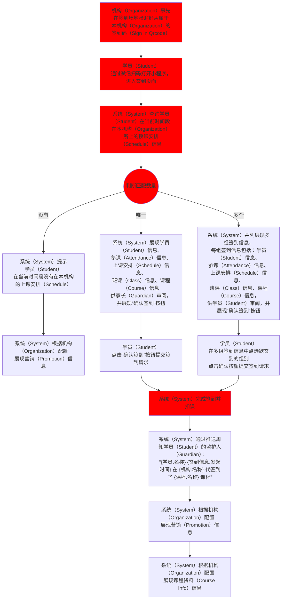
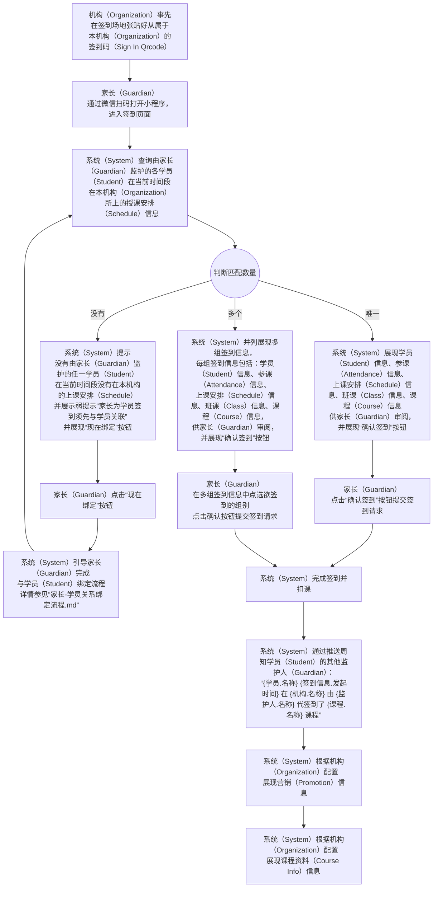
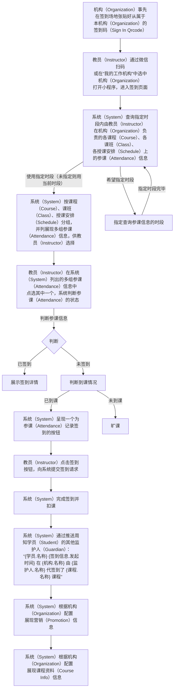

# “签到” 功能需求概要

## 流程

### 整体流程 for 学员（Student）：

### 整体流程 for 家长（Guardian）：

### 整体流程 for 教员（Instructor）：

TODO：未请假且未签到又没到课的情况需要处理好，根据机构配置进入状态“未请假未参课自动扣课时”或“未请假未参课课时顺延”，状态的变化唯一由教员触发，系统不自动调整
备注：请假的时效由机构配置，每门课程有自己的时效配置，在机构添加课程时系统引导配置，机构有默认的配置

## 页面规划：

1. 客户签到页
	* 用户
		* 学员（Student）
		* 家长（Guardian）
	* 状态
		- a. 信息确认（默认态）
			* 功能
				* 根据名称搜索机构（Organization）下课程（Course）
			* 展示信息
				* 搜索课程（Course）的搜索框
		- b. 签到成功及营销
			* 功能
				* 列出课程（Course）下的所有课班（Class）
					* 仍有学位的课班（Class）用彩色展现
					* 已满员的课班（Class）用灰色展现
				* 点选某课班（Class）后，提供列表和周期表两种形式展现该课班（Class）下的所有授课安排（Schedule）
			* 展示信息
				* 课程（Course）信息，包括名称（Name）、简介（Description）、课程负责人列表（Instructors）
				* 班课（Class）信息，包括名称（Name）、简介（Description）、班课负责人列表（Instructors）
		- c. 展现课班（Class）下的所有授课安排（Schedule）
			* 功能
				* 根据课班（Class）的配置，确定授课安排（Schedule）是必须全选还是允许部分选择，提供不同的交互形式供用户选择，选择后将授课安排（Schedule）添加到订单
				* 授课安排（Schedule）添加完毕后，点击生成订单按钮，将生成订单的请求提交到系统（System）
				* 系统（System）生成订单完毕后，跳转到订单确认页
			* 展示信息
				* 授课安排（Schedule）信息，包括上课时间（Start Time）、上课地点（Location）、上课教员（Instructor）、上课时长（Last Time）

2. 机构签到页
	* 用户
		* 教员（Instructor）
	* 状态
		* a. 负责列表（默认态）
			* 功能
				* 列出教员（Instructor）负责的在当前时段有课的课程（Course）、课班（Class）、授课安排（Schedule）供选，以便查询其下的参课（Attendance）信息
				* 指定筛选时段
			* 展示信息
				* 供选课程（Course）、课班（Class）、授课安排（Schedule）均展现名称，根据类型，稍作区别
		- b. 参课（Attendance）信息浏览
			* 功能
				* 快速浏览指定的课程（Course）、课班（Class）、授课安排（Schedule）在当前时间段内的各项参课（Attendance）信息，供点选触发代签到
				* 根据参课状态筛选：只看“已签到”、“未签到”、“待确认”、“已签退”
				* 指定筛选时段
			* 展现信息
				* 参课（Attendance）信息：
					* 参课人
					* 参课状态（未签到/已签到/已签退/请假/待确认）
					* 参课状态为“已签到”时展现：签到时间
				* 参课状态为“未签到”时展现：签到按钮、待确认按钮
				* 参课状态为“待确认”时展现：签到按钮、请假按钮
				* 参课状态为“已签到”时展现：签退按钮

4. 营销页
	* 用户
		* 学员（Student）
		* 家长（Guardian）
	* 功能
		* 展示订单（Order）信息，供用户确认
		* 订单中的授课安排列表（Schedules）于学员（Student）的上课安排列表（Schedules）存在冲突时，提示冲突部分
		* 提供确认按钮，供用户在确认时提交结账请求
	* 展示信息
		* 订单（Order）信息，包括订单发起人（Order Initiator）、订单发起时间（Order Time）、订单中授课安排列表（Order Schedules）
		* 授课安排（Schedule）信息，包括上课时间（Start Time）、上课地点（Location）、上课教员（Instructor）、上课时长（Last Time）
<!--stackedit_data:
eyJoaXN0b3J5IjpbMzY0NjQzNjAyLC0xMzUzNTQ1NzkxLC0yMD
IwMjI2NzI5LDE5NjcwNzI0NzYsMTAwNjk2NTQ1MywzNjQ1MTU0
NjEsMTMwMDU5NTQ4MSwtMTk2NTI4NTg1NiwtODEwMDQzMzI0LC
0xMTI4MzMxNTI0LC0xMDg3MzgzOTkxLDg5MTI2NDYyMCwxNzM5
NzUxNjI1LC0yMTUxMTc1MDIsNzY3MjAxNzcsLTE5Njg1MTU0Mz
ksMTkyMDY3NzA3NCwtOTMyNzg4MzcwLC02MjU0NjcwNzUsMTIy
NTY3MDU4NV19
-->