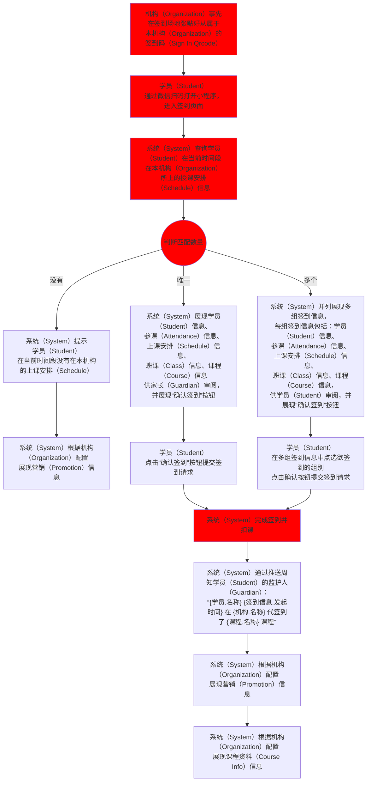
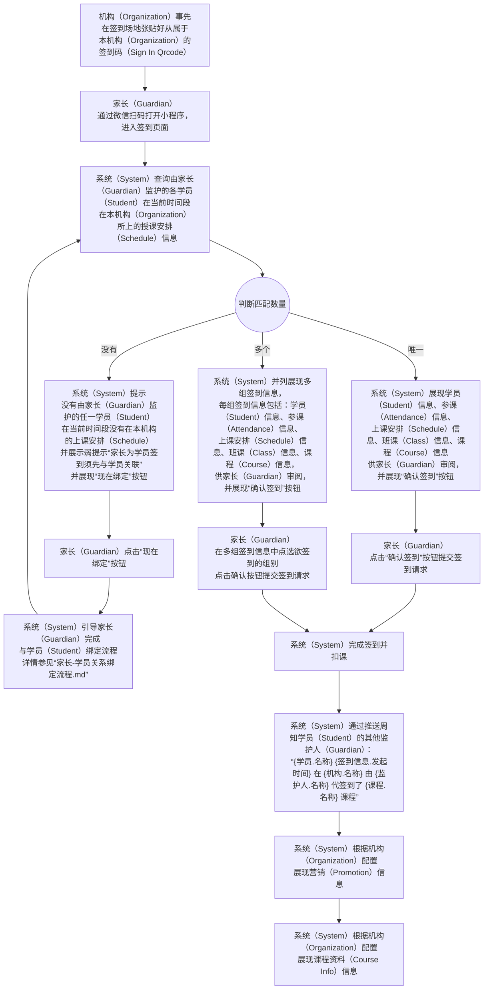
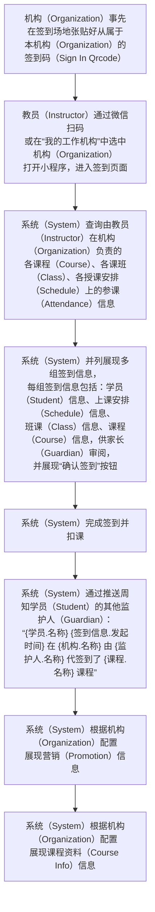

# “签到” 功能需求概要

## 流程

TODO：考虑补签到的情况

### 整体流程 for 学员（Student）：

### 整体流程 for 家长（Guardian）：

### 整体流程 for 教员（Instructor）：

## 页面规划：

1. 签到页
	* 用户
		* 学员（Student）
		* 家长（Guardian）
	* 状态
		- a. 信息确认（默认态）
			* 功能
				* 根据名称搜索机构（Organization）下课程（Course）
			* 展示信息
				* 搜索课程（Course）的搜索框
		- b. 签到成功及营销
			* 功能
				* 列出课程（Course）下的所有课班（Class）
					* 仍有学位的课班（Class）用彩色展现
					* 已满员的课班（Class）用灰色展现
				* 点选某课班（Class）后，提供列表和周期表两种形式展现该课班（Class）下的所有授课安排（Schedule）
			* 展示信息
				* 课程（Course）信息，包括名称（Name）、简介（Description）、课程负责人列表（Instructors）
				* 班课（Class）信息，包括名称（Name）、简介（Description）、班课负责人列表（Instructors）
		- c. 展现课班（Class）下的所有授课安排（Schedule）
			* 功能
				* 根据课班（Class）的配置，确定授课安排（Schedule）是必须全选还是允许部分选择，提供不同的交互形式供用户选择，选择后将授课安排（Schedule）添加到订单
				* 授课安排（Schedule）添加完毕后，点击生成订单按钮，将生成订单的请求提交到系统（System）
				* 系统（System）生成订单完毕后，跳转到订单确认页
			* 展示信息
				* 授课安排（Schedule）信息，包括上课时间（Start Time）、上课地点（Location）、上课教员（Instructor）、上课时长（Last Time）

2. 营销页
	* 用户
		* 学员（Student）
		* 家长（Guardian）
	* 功能
		* 展示订单（Order）信息，供用户确认
		* 订单中的授课安排列表（Schedules）于学员（Student）的上课安排列表（Schedules）存在冲突时，提示冲突部分
		* 提供确认按钮，供用户在确认时提交结账请求
	* 展示信息
		* 订单（Order）信息，包括订单发起人（Order Initiator）、订单发起时间（Order Time）、订单中授课安排列表（Order Schedules）
		* 授课安排（Schedule）信息，包括上课时间（Start Time）、上课地点（Location）、上课教员（Instructor）、上课时长（Last Time）
<!--stackedit_data:
eyJoaXN0b3J5IjpbLTU0MzA1OTgzOCwtOTMyNzg4MzcwLC02Mj
U0NjcwNzUsMTIyNTY3MDU4NSwyMDIxODY0MzQyLDIwMjE4NjQz
NDIsMzQ5NDQ5NzU4LDM0OTQ0OTc1OF19
-->