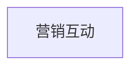
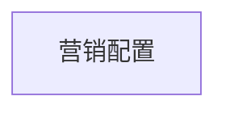

# “营销” 功能需求概要

## 流程

### 营销互动流程：

```mermaid
graph TD

营销互动

```

### 营销配置流程：

```mermaid
graph TD

营销配置

```

## 页面规划

### 营销详情

### 营销配置
<!--stackedit_data:
eyJoaXN0b3J5IjpbNTkyNDI1NzksNzMwOTk4MTE2XX0=
-->