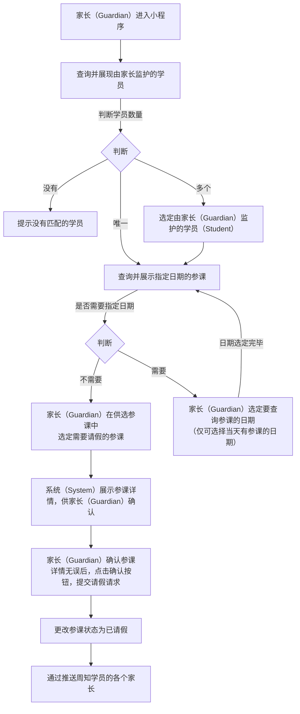

# “请假” 功能需求概要

## 流程

### 家长请假流程：



### 学员请假流程：

```mermaid
graph TD


```
<!--stackedit_data:
eyJoaXN0b3J5IjpbLTM1OTc1OTI3OCwtOTMyMDgyMjcyLC0xMz
k3NzcwNjQ0LDIxMDI5NjkwNTMsLTE1NDk1NTc2MjAsMTM0NzE4
Nzc0NiwzMTQ3OTc5NTUsLTUyOTU4MjI0LDExMDIzNjk1Myw4ND
I0MDUwMDYsMTk0OTg5NTE1MywtMzkzNDY3NTkyLC0xMjg4MjEy
NjEzLDE5Njk1Nzg0NjEsLTIxMDk0NzM2MzIsNjUzODc2NjEsMj
M2ODQzNDMsMjEwMzkyMzMyMiw4MzI1NTg0OTQsLTEzMDAyMDk5
NTRdfQ==
-->