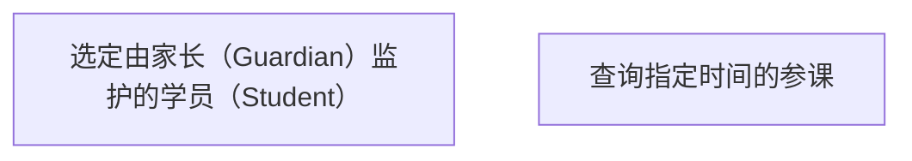

# “请假” 功能需求概要

## 流程

### 家长请假流程：

```mermaid
graph TD

选定学员

查询指定时间的参课

选定学员["<center>选定由家长（Guardian）监护的学员（Student）</center>"]

```
<!--stackedit_data:
eyJoaXN0b3J5IjpbMjM2ODQzNDMsMjEwMzkyMzMyMiw4MzI1NT
g0OTQsLTEzMDAyMDk5NTQsNzMwOTk4MTE2XX0=
-->