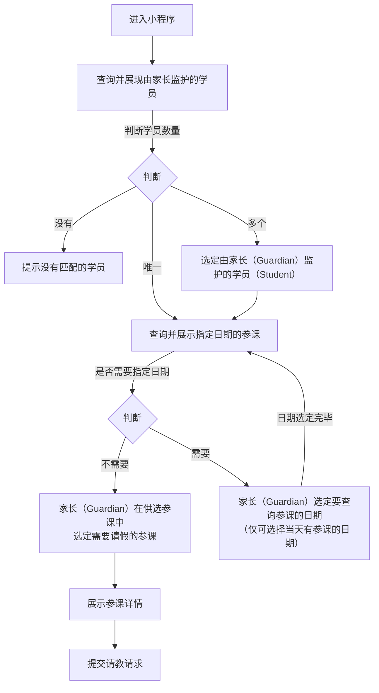

# “请假” 功能需求概要

## 流程

### 家长请假流程：

<!--stackedit_data:
eyJoaXN0b3J5IjpbNzk2OTkwMzk3LDIxMDI5NjkwNTMsLTE1ND
k1NTc2MjAsMTM0NzE4Nzc0NiwzMTQ3OTc5NTUsLTUyOTU4MjI0
LDExMDIzNjk1Myw4NDI0MDUwMDYsMTk0OTg5NTE1MywtMzkzND
Y3NTkyLC0xMjg4MjEyNjEzLDE5Njk1Nzg0NjEsLTIxMDk0NzM2
MzIsNjUzODc2NjEsMjM2ODQzNDMsMjEwMzkyMzMyMiw4MzI1NT
g0OTQsLTEzMDAyMDk5NTQsNzMwOTk4MTE2XX0=
-->