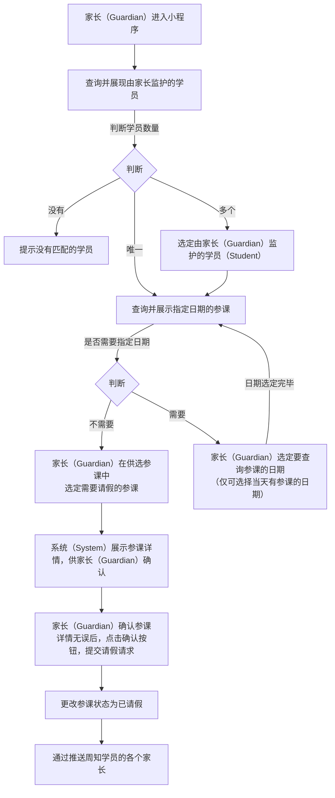

# “请假” 功能需求概要

## 流程

### 家长请假流程：

### 学员请假流程：

<!--stackedit_data:
eyJoaXN0b3J5IjpbLTE5NzY0ODgzODQsLTkzMjA4MjI3MiwtMT
M5Nzc3MDY0NCwyMTAyOTY5MDUzLC0xNTQ5NTU3NjIwLDEzNDcx
ODc3NDYsMzE0Nzk3OTU1LC01Mjk1ODIyNCwxMTAyMzY5NTMsOD
QyNDA1MDA2LDE5NDk4OTUxNTMsLTM5MzQ2NzU5MiwtMTI4ODIx
MjYxMywxOTY5NTc4NDYxLC0yMTA5NDczNjMyLDY1Mzg3NjYxLD
IzNjg0MzQzLDIxMDM5MjMzMjIsODMyNTU4NDk0LC0xMzAwMjA5
OTU0XX0=
-->