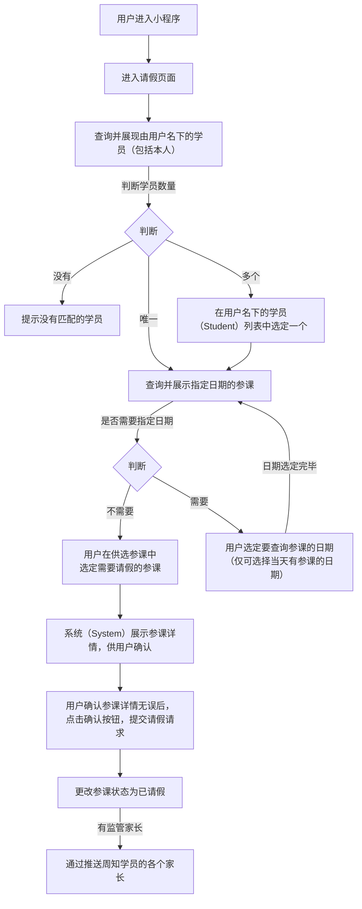

# “请假” 功能需求概要

## 流程

### 请假流程：

<!--stackedit_data:
eyJoaXN0b3J5IjpbMTA2MDQ3NDMwMiwtMzk1Njg3MzY3LC0xND
kzNjk3MzcxLC0xNDY5MDk2MTc5LC0xMDg5NTkwMTkwLC0xMDg5
NTkwMTkwLC0xOTc2NDg4Mzg0LC05MzIwODIyNzIsLTEzOTc3Nz
A2NDQsMjEwMjk2OTA1MywtMTU0OTU1NzYyMCwxMzQ3MTg3NzQ2
LDMxNDc5Nzk1NSwtNTI5NTgyMjQsMTEwMjM2OTUzLDg0MjQwNT
AwNiwxOTQ5ODk1MTUzLC0zOTM0Njc1OTIsLTEyODgyMTI2MTMs
MTk2OTU3ODQ2MV19
-->