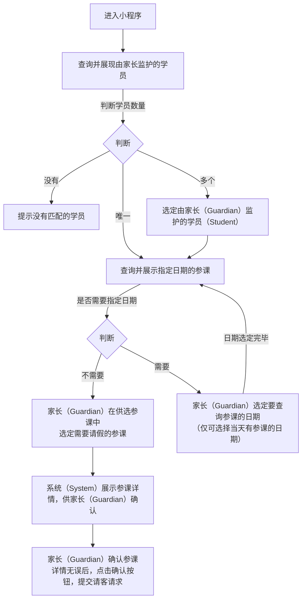

# “请假” 功能需求概要

## 流程

### 家长请假流程：

<!--stackedit_data:
eyJoaXN0b3J5IjpbLTE0OTk5MTY5ODIsMjEwMjk2OTA1MywtMT
U0OTU1NzYyMCwxMzQ3MTg3NzQ2LDMxNDc5Nzk1NSwtNTI5NTgy
MjQsMTEwMjM2OTUzLDg0MjQwNTAwNiwxOTQ5ODk1MTUzLC0zOT
M0Njc1OTIsLTEyODgyMTI2MTMsMTk2OTU3ODQ2MSwtMjEwOTQ3
MzYzMiw2NTM4NzY2MSwyMzY4NDM0MywyMTAzOTIzMzIyLDgzMj
U1ODQ5NCwtMTMwMDIwOTk1NCw3MzA5OTgxMTZdfQ==
-->