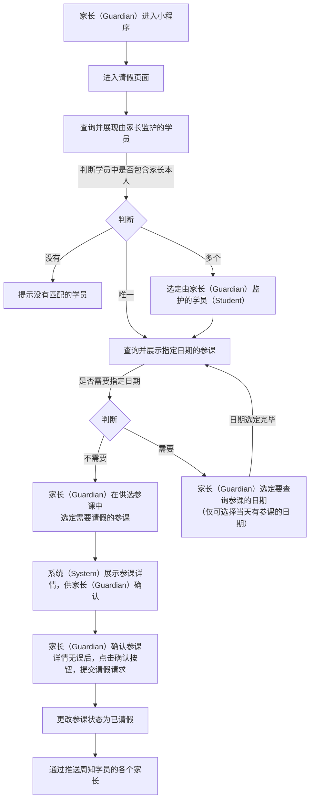

# “请假” 功能需求概要

## 流程

### 家长请假流程：

### 学员请假流程：

<!--stackedit_data:
eyJoaXN0b3J5IjpbMTYzNzA4NjA1NCwtMTA4OTU5MDE5MCwtMT
A4OTU5MDE5MCwtMTk3NjQ4ODM4NCwtOTMyMDgyMjcyLC0xMzk3
NzcwNjQ0LDIxMDI5NjkwNTMsLTE1NDk1NTc2MjAsMTM0NzE4Nz
c0NiwzMTQ3OTc5NTUsLTUyOTU4MjI0LDExMDIzNjk1Myw4NDI0
MDUwMDYsMTk0OTg5NTE1MywtMzkzNDY3NTkyLC0xMjg4MjEyNj
EzLDE5Njk1Nzg0NjEsLTIxMDk0NzM2MzIsNjUzODc2NjEsMjM2
ODQzNDNdfQ==
-->