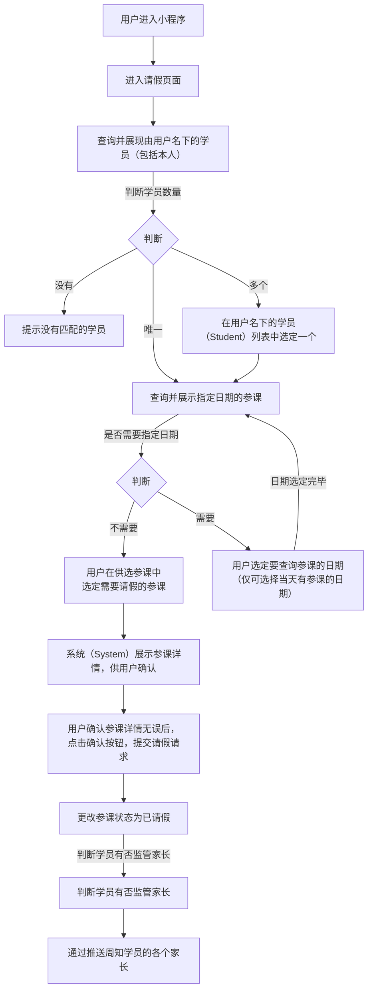

# “请假” 功能需求概要

## 流程

### 请假流程：

<!--stackedit_data:
eyJoaXN0b3J5IjpbMTA3MDY0MjA1LC0zOTU2ODczNjcsLTE0OT
M2OTczNzEsLTE0NjkwOTYxNzksLTEwODk1OTAxOTAsLTEwODk1
OTAxOTAsLTE5NzY0ODgzODQsLTkzMjA4MjI3MiwtMTM5Nzc3MD
Y0NCwyMTAyOTY5MDUzLC0xNTQ5NTU3NjIwLDEzNDcxODc3NDYs
MzE0Nzk3OTU1LC01Mjk1ODIyNCwxMTAyMzY5NTMsODQyNDA1MD
A2LDE5NDk4OTUxNTMsLTM5MzQ2NzU5MiwtMTI4ODIxMjYxMywx
OTY5NTc4NDYxXX0=
-->